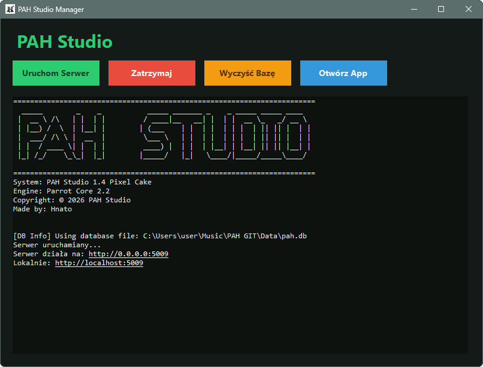
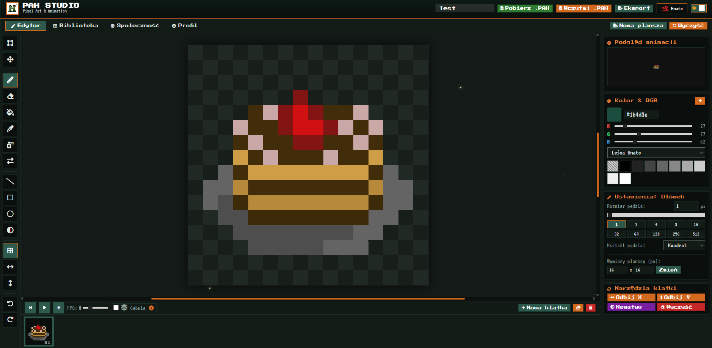
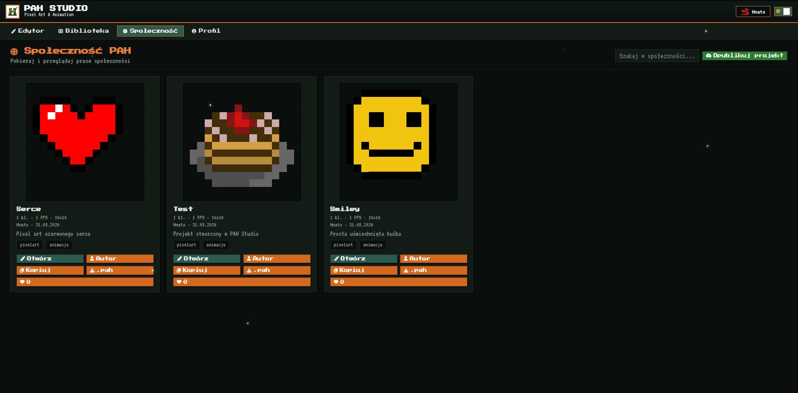
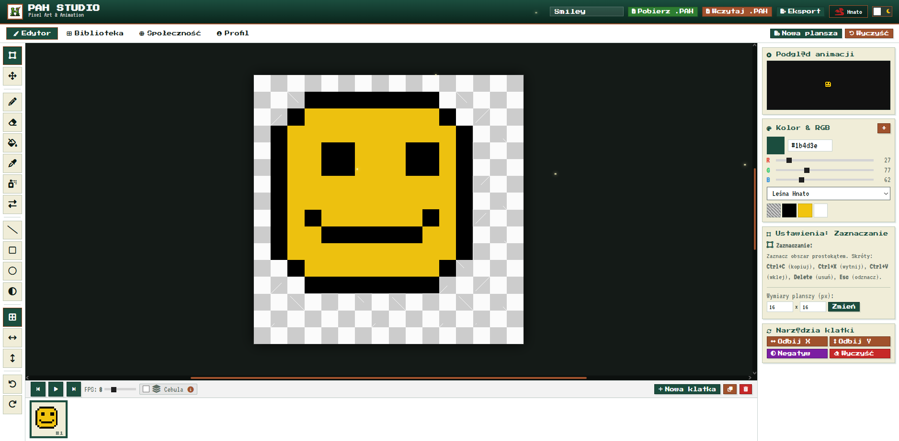

<p align="center">
  
</p>

<p align="center">
  
</p>

<p align="center">
  A dedicated pixel art and frame-by-frame animation suite featuring a browser-based canvas editor, local project management, integrated community sharing, and a standalone Windows launcher.
</p>

<p align="center">
  
  
  
  
  
</p>

---

## Overview

PAH Studio combines a lightweight HTML5 Canvas drawing editor with an ASP.NET Core backend and a Windows Forms desktop manager. Beyond standard pixel drawing, it provides a complete creation-to-export workflow: multi-frame animation, timeline controls, native `.pah` project files, export options (PNG, GIF, Sprite Sheet), and an integrated community hub with profiles, likes, and comments.

## Screenshots

### Desktop Manager

<p align="center">
  
</p>

### Editor & Community

| Editor | Community |
| :--- | :--- |
|  |  |

| Light Theme |
| :--- |
|  |

---

## Features

### Pixel Art Editor
- **Drawing Tools**: Pencil, eraser, spray brush, line, rectangle, circle, flood fill, color picker, selection, move tool, shader, and color replace.
- **Canvas Controls**: Zoom, pan, pixel grid toggle, and customizable brush sizes.
- **Workflow Utilities**: Undo/redo history, symmetry (X/Y), axis flips, color invert, and frame clearing.
- **Color Management**: Built-in palettes, RGB sliders, and custom swatch storage.
- **UI Themes**: Dark and light mode support.

### Frame-by-Frame Animation
- **Timeline Controls**: Add, duplicate, reorder, and remove frames.
- **Live Playback**: Real-time animation preview with adjustable FPS.
- **Onion Skinning**: Configurable previous/next frame ghosting for smooth in-betweening.
- **Export Formats**: Animated GIF, Sprite Sheet, or single-frame PNG.

### Community & Accounts
- **User Profiles**: Registration, authentication, customizable avatar, bio, and showcase projects.
- **Community Feed**: Browse public artworks, like projects, post comments, and fork projects directly into your own library.
- **Guest Mode**: Full editor functionality without requiring account creation.

### Native `.pah` Project Format
Projects are saved in a clean, human-readable JSON format with a `PAH_PROJECT` identifier:
- Canvas dimensions and frame sequences
- Animation FPS configuration
- Project palette and swatches
- Author metadata and tags

---

## Architecture & Tech Stack

```text
PAH GIT/
├── Client/          # Frontend (HTML5, CSS3, Vanilla JavaScript, Canvas API)
├── Server/          # Backend (.NET 8 Minimal API, Windows Forms launcher, SQLite)
├── Data/            # SQLite database storage (pah.db)
├── images/          # Documentation assets
└── PAH Studio.exe   # Compiled standalone executable
```

- **Frontend**: Vanilla JavaScript (modular architecture: `editor.js`, `animation.js`, `storage.js`, `auth.js`, `library.js`, `app.js`) rendering via HTML5 Canvas. Zero frontend build dependencies.
- **Backend**: C# / .NET 8 Minimal API handling authentication, community feeds, and persistence.
- **Desktop Launcher**: Windows Forms application to start/stop the local server, manage ports, and launch the browser client.
- **Storage**: SQLite database with client-side `localStorage` fallback when running offline.

---

## Getting Started

### Option 1: Standalone Executable (Windows)

1. Launch `PAH Studio.exe`.
2. Click **Start Server** (runs locally on port `5009` or next available).
3. Click **Open App** to open the studio in your default browser.

### Option 2: Run from Source

**Prerequisites:** Windows OS, [.NET 8 SDK](https://dotnet.microsoft.com/download/dotnet/8.0)

```powershell
# Run with desktop launcher GUI
dotnet run --project ".\Server\PAHServer.csproj"
```

### Option 3: Headless / Console Mode

To run the server without the Windows Forms UI:

```powershell
dotnet run --project ".\Server\PAHServer.csproj" -- --server
# or
dotnet run --project ".\Server\PAHServer.csproj" -- --nogui
```

---

## REST API Reference

| Endpoint | Method | Description |
| :--- | :--- | :--- |
| `/api/community` | `GET` | Fetch public community projects |
| `/api/community` | `POST` | Publish a project to community |
| `/api/community/{id}/like` | `POST` | Like a community project |
| `/api/community/{id}` | `DELETE` | Remove project from community |
| `/api/community/{id}/comments` | `GET` | Get comments for a project |
| `/api/community/{id}/comments` | `POST` | Add comment to a project |
| `/api/auth/register` | `POST` | Register a new user |
| `/api/auth/login` | `POST` | Log in existing user |
| `/api/auth/profile` | `POST` | Update user profile |
| `/api/users/{userId}` | `GET` | Get user details |
| `/api/users/{userId}/projects` | `GET` | Get user's saved projects |
| `/api/users/{userId}/projects` | `POST` | Save project to account |
| `/api/users/{userId}/projects/{id}` | `DELETE` | Delete a project |

---

## Author & Credits

- **Author**: Hnato
- **Version**: PAH Studio 1.4 (Pixel Cake)
- **Engine**: Parrot Core 2.2
